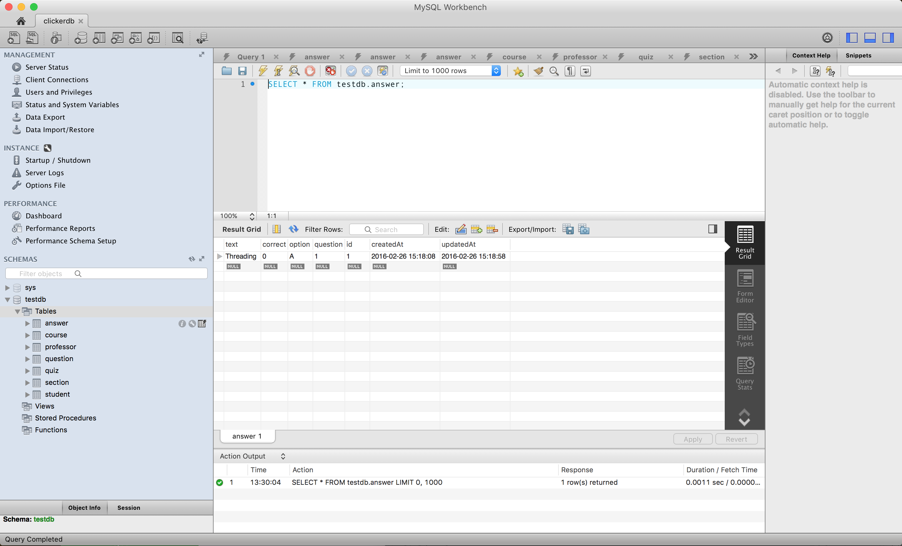
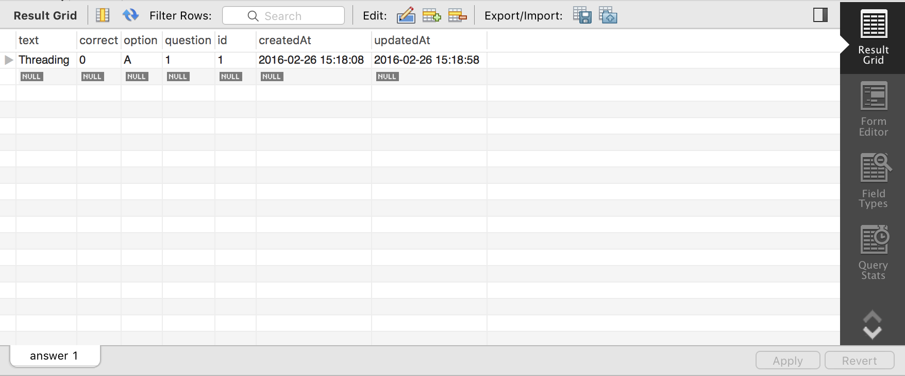
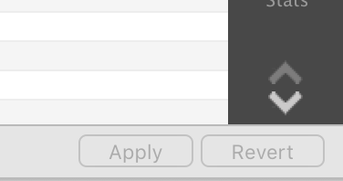

<h1>MySQL Workbench Guide</h1>

<h2>Steps:</h2>
1. Install Workbench  
2. Connect to MySQL database  
3. Load CSV data and save (per table) 

<h2>1. Install Workbench</h2>
- Download and install: http://dev.mysql.com/downloads/workbench/ 

<h2>2. Connect to MySQL database</h2>
- Open MySQL  
- At top. Click on plus.   
<code>
	Stored Connection: [name of connection]
	Connection Method: Standard (TCP/IP)
	Parameters
	Hostname: 127.0.0.1 Port: 3306
	Username: root
</code>
 
-OK  
-Double click on new connection (with [name of connection])  
-Enter password for db  

<h2>3. Load CSV data and save (per table)</h2>
- Left side -> Under Schemas -> click on [db name]:  
<h3>NOTE: (DO FOR EACH TABLE)</h3>
<h4>NOTE: Order for filling tables:</h4>
1.Professor 
2.Course 
3.Section 
4.Quiz 
5.Question 
6.Student 
7.Answer 
8.studentAnswer 
9.section_students__student_sections 

<h4>STEPS:</h4)
- Click on table with lightning highlighted in below image. On left side under SCHEMAS -> [namedb] -> Tables -> [tablename1]  
  

  
- In Result Grid bar. Click on import:  
  
- Navigate to .csv with name of table in Quizzly/db/ and select. Result Grid should be populated.  
- In Result Grid. Select first object in Result Grid (if its not correct data [heading data]).  Then in Result Grid bar, select red minus table sign (to delete): 
  
- Hit apply at bottom right. 
  
- Hit apply in next window. Result should say: Execute SQL Statements. SQL script was successfully applied to the database. 
-Close. Table on MySQL is now filled with csv data!  
-Go to next table and repeat from NOTE!